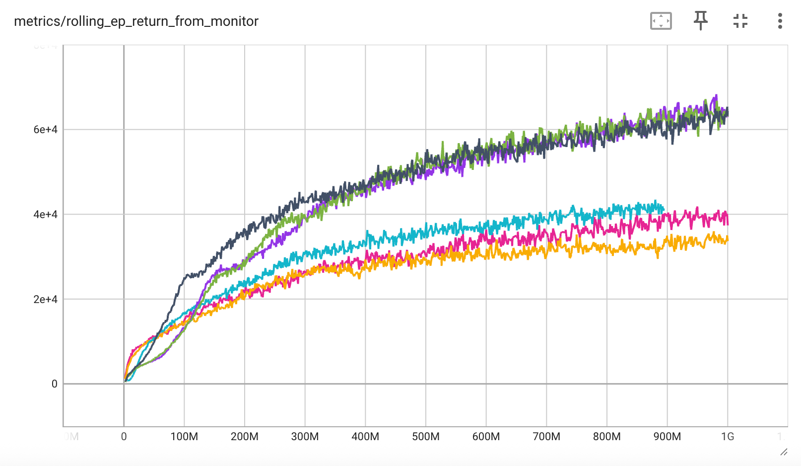
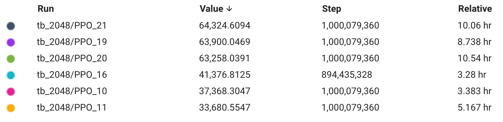
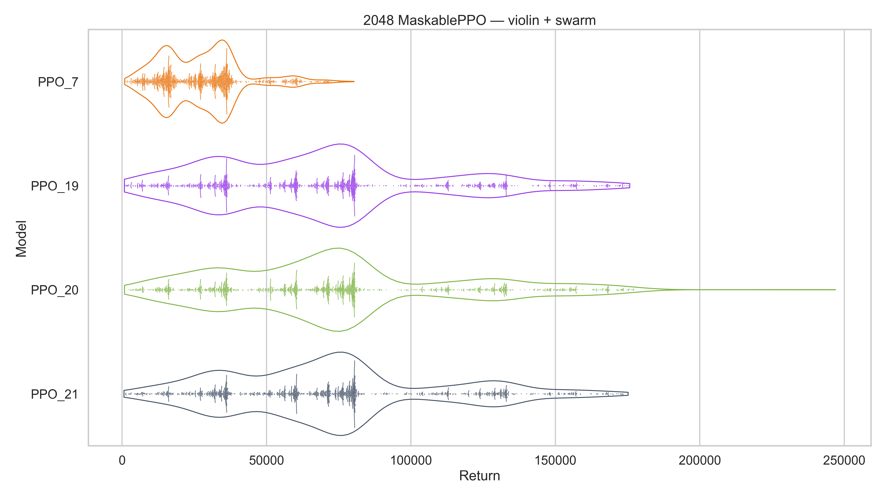
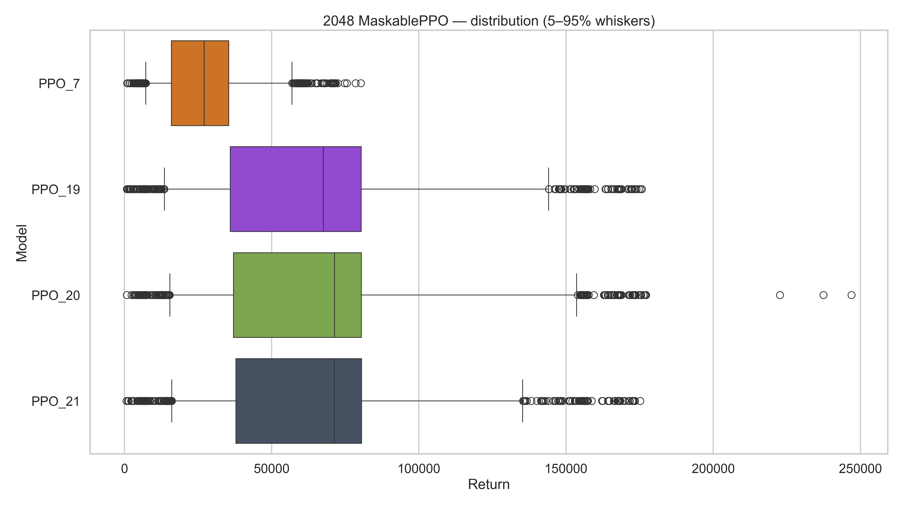
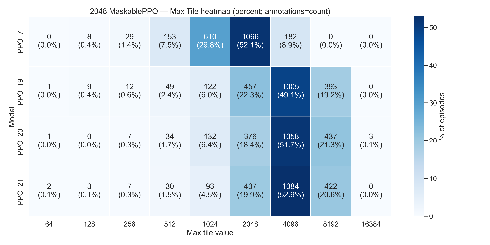

# game_2048_RL

## 프로젝트 개요
본 프로젝트는 강화학습을 이용해 2048 게임을 학습하는 프로젝트입니다.  
MaskablePPO 알고리즘과 커스텀 2048 환경을 활용하여, 에이전트가 2048 게임 환경에서 최적의 전략을 스스로 학습할 수 있도록 설계되었습니다.  
다양한 모델 구조와 학습 전략을 실험하며, 학습된 에이전트의 성능을 시각적으로 비교할 수 있습니다.

---

## 환경 설정

### uv 설치
`uv`는 Python 프로젝트 관리 및 실행을 단순화하는 도구입니다.  
아직 설치하지 않았다면 아래 명령어로 설치할 수 있습니다:
```bash
pip install uv
```

### 가상환경 생성 & 의존성 동기화 (권장)
프로젝트 루트(이 파일이 있는 위치)에서 아래 순서로 실행하세요.  
`pyproject.toml`과 `uv.lock`을 기준으로 재현 가능한 환경이 만들어집니다.
```bash
uv venv          # .venv 생성 (프로젝트 전용 가상환경)
uv sync          # pyproject.toml / uv.lock 기반으로 패키지 설치
```
> 참고: `uv sync`는 `pip install -r requirements.txt`와 같은 역할을 하지만,  
> `pyproject.toml` 및 `uv.lock`을 기반으로 더 안전하고 빠르게 설치합니다.  
> `uv run ...`은 `.venv`를 자동 인식하므로 **일반적으로 수동 활성화는 필요 없습니다.**

필요하다면 직접 활성화할 수도 있습니다:
```bash
# (선택) 가상환경 직접 활성화
source .venv/bin/activate   # Linux / macOS
.venv\Scripts\activate      # Windows
```

- Python 버전: 3.13 이상  
- 주요 패키지: `torch`, `stable-baselines3`, `sb3-contrib`, `numpy`, `matplotlib`, `seaborn`  
- 전체 의존성은 `pyproject.toml` 파일을 참고하세요  

---

## 폴더 구조
- `env`: 2048 게임 환경 관련 코드  
  - `batch2048_core.py`: 2048 게임의 핵심 로직 및 상태 관리  
  - `adapters_2048.py`: 환경과 에이전트 간의 인터페이스 및 어댑터 구현
- `train`: 학습 실행 및 유틸리티 코드  
  - `train_main.py`: 학습 실행을 위한 메인 스크립트  
  - `train_utils.py`: 학습 보조 함수 및 유틸리티 모음
- `eval`: 학습된 모델 평가 스크립트  
  - `single_eval.py`: 단일 모델 평가 및 결과 출력  
  - `muti_eval.py`: 여러 모델의 성능을 비교 평가
- `image`: 학습 및 평가 결과 그래프 저장 위치 (모델별 성능 비교 및 분포 시각화)
- `tb_2048`: TensorBoard 로그 저장 폴더 (학습 과정 모니터링)

---

## 학습 방법
아래 명령어로 학습을 시작할 수 있습니다:
```bash
uv run train/train_main.py
```

학습 과정을 실시간으로 모니터링하려면, 별도의 터미널에서 TensorBoard를 실행하세요:
```bash
tensorboard --logdir tb_2048
```
웹 브라우저에서 `localhost:6006`에 접속하면 학습 로그 및 그래프를 확인할 수 있습니다.

---

## 평가 방법
학습된 모델을 평가하려면 다음 명령어를 사용하세요:
```bash
uv run eval/single_eval.py
uv run eval/muti_eval.py
```
평가 결과로 모델별 점수 분포, 최고 점수, 평균 점수 등 다양한 지표와 그래프를 확인할 수 있습니다.

---

## 실험 결과

### A. 학습 로그 기반 비교 (TensorBoard)
- **학습 곡선**  
  

- **그래프 설명**  
  

아래 두 표는 위 **학습 로그**를 기반으로 동일(또는 유사) 스텝에서의 모델 비교입니다.

#### 모델별 최종 점수 비교 (from TensorBoard)
| Run    | Value     | Step          | Relative |
|--------|-----------|---------------|----------|
| PPO_21 | 64,324.6  | 1,000,079,360 | 10.06 hr |
| PPO_19 | 63,900.0  | 1,000,079,360 | 8.74 hr  |
| PPO_20 | 63,258.0  | 1,000,079,360 | 10.54 hr |
| PPO_16 | 41,376.8  | 894,435,328   | 3.28 hr  |
| PPO_10 | 37,368.3  | 1,000,079,360 | 3.38 hr  |
| PPO_11 | 33,680.6  | 1,000,079,360 | 5.17 hr  |

#### 모델 설정 및 성능 요약 (학습 설정)
| 모델   | 2048 점수 | obs       | net_arch                          | act_fn | num_envs | n_steps |
|--------|-----------|-----------|-----------------------------------|--------|----------|---------|
| PPO_21 | 64,324.6  | onehot256 | pi=[256, 256, 128], vf=[256, 256] | ReLU   | 2^15     | 2^3     |
| PPO_19 | 63,900.0  | onehot256 | pi=[256, 256], vf=[256, 256]      | ReLU   | 2^15     | 2^3     |
| PPO_20 | 63,258.0  | onehot256 | pi=[256, 256], vf=[256, 256]      | SiLU   | 2^15     | 2^3     |
| PPO_16 | 41,376.8  | uint8x16  | pi=[256, 256], vf=[256, 256]      | ReLU   | 2^15     | 2^3     |
| PPO_10 | 37,368.3  | uint8x16  | pi=[256, 256], vf=[256, 256]      | ReLU   | 2^10     | 2^8     |
| PPO_11 | 33,680.6  | uint8x16  | pi=[256, 256], vf=[256, 256]      | Tanh   | 2^10     | 2^8     |
| PPO_7  | 26,770.7  | onehot256 | pi=[64, 64], vf=[64, 64]          | Tanh   | 2^10     | 2^8     |

---

### B. 결정적 정책 평가 (Batch 2048, Deterministic)
`eval/muti_eval.py`를 사용해 학습 중 성능이 가장 좋았던 **PPO_21, PPO_19, PPO_20**과 기준선으로 **PPO_7**을 선택하여,  
`deterministic=True`로 **2048개 환경을 병렬 실행**하고 모든 에피소드가 종료될 때까지 누적 보상을 기록했습니다.

|  |  |  |
|:---------------------------------:|:---------------------------------:|:---------------------------------:|
| - 2048 점수 분포 (바이올린 플롯 윤곽선은 밀도를, 점은 각 환경의 점수를 의미) | - 점수 박스 플롯 (상자는 25–75% 범위를, 중앙선은 중앙값을 의미. O 표시는 극단값) | - 최대 타일 히트맵 (각 셀은 달성 환경 수와 비율을 의미) |

#### 결정적 평가 성능 통계
| 모델   | Mean     | Q25    | Median  | Q75    | FPS      |
|--------|----------|--------|---------|--------|----------|
| PPO_21 | 71,548.1 | 37,863 | 71,332  | 80,579 | 1,455,950 |
| PPO_20 | 72,763.2 | 37,090 | 71,360  | 80,510 | 1,027,661 |
| PPO_19 | 68,054.4 | 36,002 | 67,570  | 80,448 |   910,490 |
| PPO_7  | 26,963.1 | 15,991 | 27,116  | 35,441 |   919,682 |
---

## 기여 방법
이 프로젝트에 관심이 있다면 issue 등록이나 Pull Request(PR)를 통해 자유롭게 기여해 주세요.  
버그 제보, 기능 추가, 코드 개선 등 다양한 형태의 기여를 환영합니다!